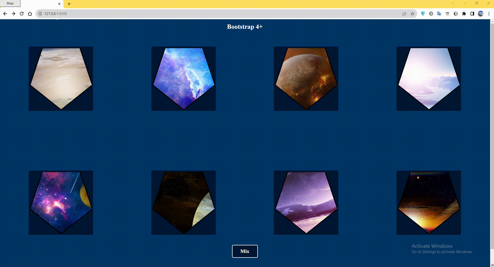

# So.Use 

## *1) Info about* :white_check_mark: / О проекте
>This repository is a test task from So.Use. / Репозиторий является тестовым заданием от компании So.Use

## Covering letter // Сопроводительное письмо
>Проект выполнен на html, vanila js, SASS, bootstrap.
>> В проекте две страницы, index и bootstrap, на страницу bootstrap можете попасть по ссылке в header index.html. В связи с тем, что проект маленький, не стал подключать gulp-sass и gulp-autoprefix.
>>>Подключение bootstrap выполнено с помощью js, через link и script, так как посчитал, что в данном проекте нет необходимости локально загружать библиотеку.

>>>>PS. В Проекте на мой взгляд есть недочеты связанные с bootstrap, т.к не идеально владею библиотекой и немного не хватило времени (поздно начал).  

